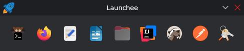

  
  
  

## 💻 Launchee

**Launchee** is a **lightweight dock** that provides a clean, minimalist panel **for launching your favorite applications**.

## 💖 Support

Hey there! If you enjoy my work and would like to support me, consider buying me a coffee! :slightly_smiling_face: Your
contributions help me keep creating, and I truly appreciate every bit of support you offer.

  

Also, please consider giving this project a ⭐ on GitHub. This kind of support helps promote the project and lets others
know that it's worth checking out.

Thank you for being amazing!

## ©️ License

© 2025-2025 Javaheim

This project is licensed under the Apache License, Version 2.0. See the [LICENSE](LICENSE) file for full license terms.
